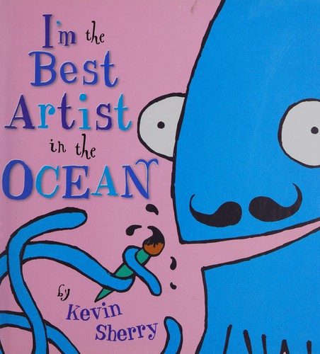
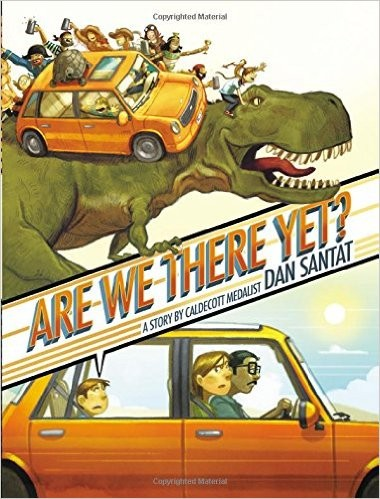
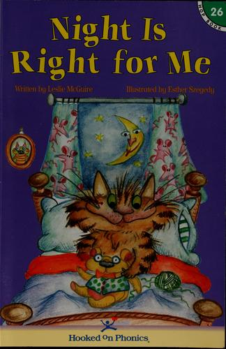
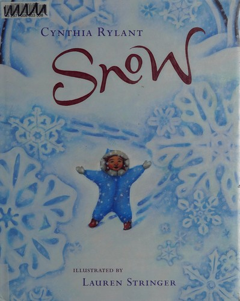

# On the Shelf

Books we own (and one school-library loan), with covers.

Daily log lives in [read.md](read.md). Covers are in [`covers/`](covers/).

Reader: Mitch (Dad) · also Amy  
Started: August 27, 2026

---

## Home copies

### 1. The Night Before Kindergarten


- **Author:** Natasha Wing · **Illustrated by:** Julie Durrell
- **ISBN:** `978-0-448-42500-9`
- **How we read it:** swapped “kindergarten” for “2nd grade”
- **Read:** Tuesday, August 25, 2026 · Mitch

---

### 2. Cowboy Car


- **Author:** Jeanie Franz Ransom · **Illustrated by:** Ovi Nedelcu
- **Read:** Tuesday, August 25, 2026 · Mitch

---

### 3. Except Antarctica!


- **Author / illustrator:** Todd Sturgell
- **Read:** Tuesday, August 25, 2026 · Mitch

---

### 4. Garfield’s Scary Tales


- **Author:** Jim Kraft · **Illustrated by:** Mike Fentz
- **Favorites:** *Terminal Terror* and *A Ghost’s Story*
- **Read:** Monday, August 24, 2026 · Mitch

---

### 5. My, Oh My—A Butterfly!


- **Series:** The Cat in the Hat’s Learning Library · Tish Rabe
- **Read:** Tuesday, August 25, 2026 · Mitch

---

### 6. Hooked on Phonics / *Whacky Jack!*


- **Story:** Jonathan London · Doug Cushman · Jack the raccoon learns baseball
- **Note:** pink phonics cover and *Whacky Jack!* are two sides of the same book
- **Read:** Thursday, August 27, 2026 · Mitch

---

### 7. On Beyond Bugs!


- **Series:** The Cat in the Hat’s Learning Library · Tish Rabe
- **Read:** Thursday, August 27, 2026 · Mitch

---

### 8. Don’t Close Your Eyes


- **Author:** Bob Hostetler · **Illustrated by:** Mark Chambers
- **Read:** Thursday, August 27, 2026 · Mitch

---

### 9. There Was an Old Lady Who Swallowed a Fly


- **Illustrated by:** Pam Adams · Child’s Play die-cut edition
- **Read:** Thursday, August 27, 2026 · Mitch

---

### 10. Swap!


- **Author / illustrator:** Steve Light
- **Favorite:** Saturday, August 29, 2026
- **Read:** Saturday, August 29, 2026 · Mitch

---

### 11. It’s the Great Pumpkin, Charlie Brown


- **By:** Charles M. Schulz
- **Read:** Saturday, August 29, 2026 · Mitch

---

### 12. The Hat


- **Author / illustrator:** Jan Brett
- **Read:** Saturday, August 29, 2026 · Mitch

---

### 13. Oh, the Things They Invented!


- **Series:** The Cat in the Hat’s Learning Library · Bonnie Worth
- **Read:** Saturday, August 29, 2026 · Mitch

---

### 14. The Remember Balloons


- **Author:** Jessie Oliveros · **Illustrated by:** Dana Wulfekotte
- **ISBN:** `978-1-4814-8915-7`
- **Read:** Sunday, August 30, 2026 · Mitch

---

### 15. Frog Song


- **Author:** Brenda Z. Guiberson · **Illustrated by:** Gennady Spirin
- **ISBN:** `978-0-8050-9254-7`
- **Read:** Sunday, August 30, 2026 · Mitch

---

### 16. The Party


- **Author / illustrator:** David McPhail
- **Favorite:** Sunday, August 30, 2026
- **Read:** Sunday, August 30, 2026 · Mitch

---

### 17. The Secret of Saying Thanks


- **Author:** Douglas Wood · **Illustrated by:** Greg Shed
- **ISBN:** `978-0-689-85410-1`
- **Read:** Monday, August 31, 2026 · Mitch

---

### 18. Make Way for McCloskey: A Robert McCloskey Treasury


- **Author / illustrator:** Robert McCloskey · intro Leonard S. Marcus
- **ISBN:** `978-0-670-05934-8`
- **Read so far:**
  - *Make Way for Ducklings* and *Blueberries for Sal* — Monday, August 31, 2026 · Mitch (favorite that night: *Make Way for Ducklings*)
  - *Burt Dow, Deep-Water Man* — Thursday, September 3, 2026 · Mitch
  - *Homer Price* (the donut-machine story) — Sunday, September 13, 2026 · Mitch
  - *Lentil* — Thursday, September 17, 2026 · Mitch
- **Still to read:** *Time of Wonder*; *One Morning in Maine*; *Centerburg Tales*

---

### 19. Clam-I-Am!


- **Series:** The Cat in the Hat’s Learning Library · Tish Rabe
- **ISBN (this copy):** `978-0-00-728485-6`
- **Read:** Monday, August 31, 2026 · Mitch

---

### 20. Miles and Miles of Reptiles


- **Series:** The Cat in the Hat’s Learning Library · Tish Rabe
- **ISBN (this copy):** `978-0-00-746036-6`
- **Read:** Tuesday, September 1, 2026 · Mitch

---

### 21. I’m the Best Artist in the Ocean!



- **Author / illustrator:** Kevin Sherry
- **ISBN:** `978-0-8037-3255-1`
- **Read:** Thursday, September 3, 2026 · Mitch

---

### 22. Are We There Yet?



- **Author / illustrator:** Dan Santat
- **Publisher:** Little, Brown
- **ISBN:** `978-0-316-19999-5`
- **Read:** Sunday, September 13, 2026 · Mitch

---

### 23. Night Is Right for Me



- **Author:** Leslie McGuire · **Illustrated by:** Esther Szegedy
- **Series:** Hooked on Phonics Learn to Read, Book 26
- **ISBN:** `978-1-887942-47-8`
- **Read:** Sunday, September 13, 2026 · Mitch

---

### 24. Snow



- **Author:** Cynthia Rylant · **Illustrated by:** Lauren Stringer
- **Publisher:** Harcourt / Houghton Mifflin Harcourt (2008)
- **ISBN:** `978-0-15-205303-1`
- **Format:** Hardcover · 40 pages
- **About:** A snowy day with a child, a friend, and a grandmother — falling snow, quiet streets, and the feeling of winter.
- **On our bookshelf:** home copy
- **Read:** Sunday, September 20, 2026 · Mitch · only book before he fell asleep

---

## On loan (not a home copy)

### Chickens


- **Author:** Mary Ann McDonald
- **Source:** **Mt. View Elementary School library (MVES)** · call number `636.5 MCD`
- **Favorite:** Saturday, August 29, 2026
- **Read:** Saturday, August 29, 2026 · Mitch

---

## How to add a book

Copy a card above. Drop the cover JPEG in `covers/` and use:

```

```

Or send a photo and ask to add it.
