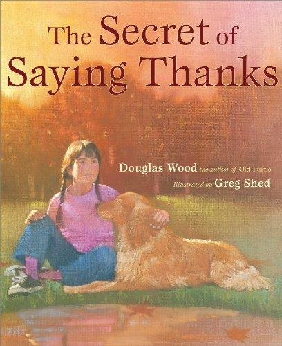
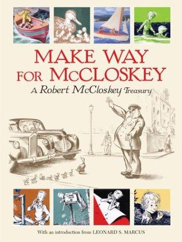
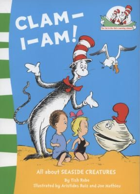
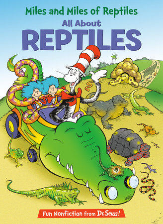

# Books We Read

A catalog of books on our shelf, with covers, plus a log we can update every day.

Reader: Mitch (Dad) · also Amy  
Started: August 27, 2026

Covers are stored in this repo under [`covers/`](covers/).

---

## On the shelf

### 1. The Night Before Kindergarten

- **Author:** Natasha Wing
- **Illustrated by:** Julie Durrell
- **Publisher:** Grosset & Dunlap (2001)
- **ISBN:** `978-0-448-42500-9`
- **Read?** [x] — Tuesday, August 25, 2026 · Mitch
- **How we read it:** Swapped “kindergarten” for “2nd grade” — Wednesday, August 26 was the first day of second grade.

---

### 2. Cowboy Car

- **Author:** Jeanie Franz Ransom · **Illustrated by:** Ovi Nedelcu
- **Publisher:** Two Lions (2017) · ISBN `978-1-5039-5097-9`
- **Read?** [x] — Tuesday, August 25, 2026 · Mitch

---

### 3. Except Antarctica!

- **Author / illustrator:** Todd Sturgell
- **Publisher:** Sourcebooks Explore (2021) · ISBN `978-1-7282-3326-0`
- **Read?** [x] — Tuesday, August 25, 2026 · Mitch

---

### 4. Garfield’s Scary Tales

- **Author:** Jim Kraft · **Illustrated by:** Mike Fentz
- **Publisher:** Grosset & Dunlap (1990) · ISBN `978-0-448-40036-5`
- **Favorites:** *Terminal Terror* and the camping story (*A Ghost’s Story*).
- **Read?** [x] — Monday, August 24, 2026 · Mitch

---

### 5. My, Oh My—A Butterfly!

- **Series:** The Cat in the Hat’s Learning Library · Tish Rabe
- **ISBN (this copy):** `978-0-00-810098-8`
- **Read?** [x] — Tuesday, August 25, 2026 · Mitch

---

### 6. Hooked on Phonics / *Whacky Jack!*

- **Story:** Jonathan London · Doug Cushman · Jack the raccoon learns baseball
- **Read?** [x] — Thursday, August 27, 2026 · bedtime · Mitch

---

### 7. On Beyond Bugs!

- **Series:** The Cat in the Hat’s Learning Library · Tish Rabe · ISBN `978-0-679-87303-7`
- **Read?** [x] — Thursday, August 27, 2026 · bedtime · Mitch

---

### 8. Don’t Close Your Eyes

- **Author:** Bob Hostetler · Mark Chambers · ISBN `978-1-4002-0951-4`
- **Read?** [x] — Thursday, August 27, 2026 · bedtime · Mitch

---

### 9. There Was an Old Lady Who Swallowed a Fly

- **Illustrated by:** Pam Adams · Child’s Play · ISBN `978-1-904550-62-4`
- **Read?** [x] — Thursday, August 27, 2026 · bedtime · Mitch

---

### 10. Chickens

- **Author:** Mary Ann McDonald · ISBN `978-1-56766-374-7`
- **Source:** **MVES library loan** · call number `636.5 MCD`
- **Favorite:** Saturday, August 29, 2026
- **Read?** [x] — Saturday, August 29, 2026 · Mitch

---

### 11. Swap!

- **Author / illustrator:** Steve Light · ISBN (this copy) `978-1-4063-6776-8`
- **Favorite:** Saturday, August 29, 2026
- **Read?** [x] — Saturday, August 29, 2026 · Mitch

---

### 12. It’s the Great Pumpkin, Charlie Brown

- **By:** Charles M. Schulz · ISBN `978-1-4814-5388-7`
- **Read?** [x] — Saturday, August 29, 2026 · Mitch

---

### 13. The Hat

- **Author / illustrator:** Jan Brett · ISBN `978-0-399-54738-6`
- **Read?** [x] — Saturday, August 29, 2026 · Mitch

---

### 14. Oh, the Things They Invented!

- **Series:** The Cat in the Hat’s Learning Library · Bonnie Worth · ISBN `978-0-449-81497-0`
- **Read?** [x] — Saturday, August 29, 2026 · Mitch

---

### 15. The Remember Balloons

- **Author:** Jessie Oliveros · **Illustrated by:** Dana Wulfekotte
- **Publisher:** Simon & Schuster (2018) · ISBN `978-1-4814-8915-7`
- **Read?** [x] — Sunday, August 30, 2026 · Mitch

---

### 16. Frog Song

- **Author:** Brenda Z. Guiberson · **Illustrated by:** Gennady Spirin
- **ISBN:** `978-0-8050-9254-7`
- **Read?** [x] — Sunday, August 30, 2026 · Mitch

---

### 17. The Party

- **Author / illustrator:** David McPhail · Hooked on Phonics paperback
- **Favorite:** Sunday, August 30, 2026
- **Read?** [x] — Sunday, August 30, 2026 · Mitch

---

### 18. The Secret of Saying Thanks

- **Author:** Douglas Wood · **Illustrated by:** Greg Shed
- **ISBN:** `978-0-689-85410-1`
- **Read?** [x] — Monday, August 31, 2026 · Mitch

---

### 19. Make Way for McCloskey: A Robert McCloskey Treasury

- **Author / illustrator:** Robert McCloskey · intro Leonard S. Marcus · ISBN `978-0-670-05934-8`
- **Read so far:** *Make Way for Ducklings* and *Blueberries for Sal* — Monday, August 31, 2026 · Mitch
- **Favorite that night:** *Make Way for Ducklings*
- **Still to read:** *Lentil*; *Time of Wonder*; *One Morning in Maine*; *Burt Dow, Deep-Water Man*; *Homer Price*; *Centerburg Tales*

---

### 20. Clam-I-Am!

- **Title:** *Clam-I-Am! All About Seaside Creatures*
- **Series:** The Cat in the Hat’s Learning Library · Tish Rabe
- **ISBN (this copy):** `978-0-00-728485-6`
- **Read?** [x] — Monday, August 31, 2026 · Mitch

---

### 21. Miles and Miles of Reptiles

- **Title:** *Miles and Miles of Reptiles: All About Reptiles*
- **Series:** The Cat in the Hat’s Learning Library
- **Author:** Tish Rabe
- **Illustrated by:** Aristides Ruiz and Joe Mathieu
- **Publisher:** HarperCollins (this copy, Indian Subcontinent / UK) / Random House (US)
- **ISBN (this copy):** `978-0-00-746036-6` · US: `978-0-375-82884-3`
- **Format:** Paperback · 48 pages · £5.99
- **Ages:** 5–9
- **About:** The Cat in the Hat in his Crocodile Car — lizards, snakes, turtles vs tortoises, chameleons, crocodiles.
- **On our bookshelf:** home copy
- **Read?** [x] — Tuesday, September 1, 2026 · Mitch · only book finished before he dozed off

---

## How to add a new book

Copy a card above. Drop the cover JPEG in `covers/` and use ``. Or send a photo.

---

## Daily reading log

Newest day first.

### 2026-09-01 — Tuesday

One book, read fully by Mitch before he dozed off to sleep.

- **Book:** *Miles and Miles of Reptiles: All About Reptiles*
- **Who read:** Mitch
- **Notes:** Home copy. Fifth Cat in the Hat Learning Library title. ISBN 978-0-00-746036-6. Only book finished tonight.

---

### 2026-08-31 — Monday

Three books from the home shelf, read by Mitch.

**Favorite:** *Make Way for Ducklings*

- **Book:** *The Secret of Saying Thanks*
- **Who read:** Mitch

- **Book:** *Make Way for McCloskey* — *Make Way for Ducklings* and *Blueberries for Sal* only
- **Who read:** Mitch
- **Notes:** Favorite story tonight: *Make Way for Ducklings*. Other treasury stories saved for another night.

- **Book:** *Clam-I-Am! All About Seaside Creatures*
- **Who read:** Mitch

---

### 2026-08-30 — Sunday

**Favorite:** *The Party*

- **Book:** *The Remember Balloons*
- **Book:** *Frog Song*
- **Book:** *The Party* — favorite

---

### 2026-08-29 — Saturday

**Favorites:** *Chickens* and *Swap!*

- **Book:** *Chickens* (MVES library loan)
- **Book:** *Swap!*
- **Book:** *It’s the Great Pumpkin, Charlie Brown*
- **Book:** *The Hat*
- **Book:** *Oh, the Things They Invented!*

---

### 2026-08-28 — Friday

- **Book:** none · Amy did not read any books Friday.

---

### 2026-08-27 — Thursday

- **Book:** *Whacky Jack!* / Hooked on Phonics
- **Book:** *On Beyond Bugs!*
- **Book:** *Don’t Close Your Eyes*
- **Book:** *There Was an Old Lady Who Swallowed a Fly*

---

### 2026-08-26 — Wednesday

First day of second grade. Amy did not read any of these books.

---

### 2026-08-25 — Tuesday

- **Book:** *The Night Before Kindergarten* (read as 2nd grade)
- **Book:** *Cowboy Car*
- **Book:** *Except Antarctica!*
- **Book:** *My, Oh My—A Butterfly!*

---

### 2026-08-24 — Monday

- **Book:** *Garfield’s Scary Tales*
- **Favorite part:** *Terminal Terror* and the camping story (*A Ghost’s Story*)
