# Books We Read

A catalog of books on our shelf, with covers, plus a log we can update every day.

Reader: Mitch (Dad) · also Amy  
Started: August 27, 2026

Covers are stored in this repo under [`covers/`](covers/).

---

## On the shelf

### 1. The Night Before Kindergarten

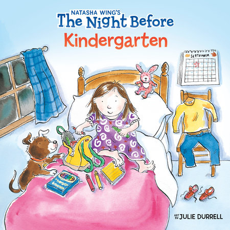

- **Author:** Natasha Wing
- **Illustrated by:** Julie Durrell
- **Publisher:** Grosset & Dunlap (2001)
- **ISBN:** `978-0-448-42500-9`
- **Format:** Paperback · 32 pages
- **Ages:** 4–8
- **About:** A rhyming first-day-of-school story. Kids pack supplies, feel excited and a little scared, and find out kindergarten can be fun.
- **How we read it:** Swapped “kindergarten” for “2nd grade” — Wednesday, August 26 was the first day of second grade.
- **Read?** [x] — Tuesday, August 25, 2026 · Mitch

---

### 2. Cowboy Car

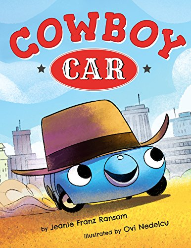

- **Author:** Jeanie Franz Ransom
- **Illustrated by:** Ovi Nedelcu
- **Publisher:** Two Lions (2017)
- **ISBN:** `978-1-5039-5097-9`
- **Format:** Hardcover · 40 pages
- **Ages:** 3–7
- **About:** Little Car has wanted to be a cowboy since he was knee-high to his daddy’s hubcaps. Everyone says cars can’t be cowboys — so he heads Out West to prove them wrong.
- **Read?** [x] — Tuesday, August 25, 2026 · Mitch

---

### 3. Except Antarctica!

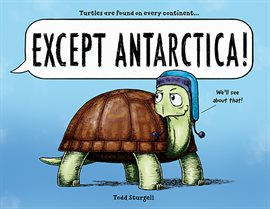

- **Author / illustrator:** Todd Sturgell
- **Publisher:** Sourcebooks Explore (2021)
- **ISBN:** `978-1-7282-3326-0`
- **Format:** Hardcover · 40 pages
- **Ages:** 4–8
- **About:** Turtles, owls, snakes, and beetles live on every continent — except Antarctica. One stubborn turtle decides to change that and takes friends along.
- **Read?** [x] — Tuesday, August 25, 2026 · Mitch

---

### 4. Garfield’s Scary Tales

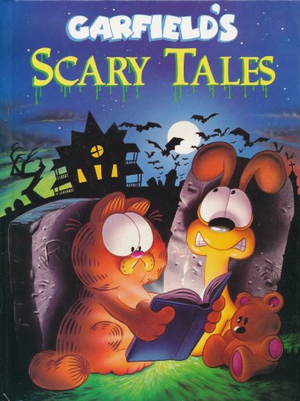

- **Author:** Jim Kraft (Garfield created by Jim Davis)
- **Illustrated by:** Mike Fentz
- **Publisher:** Grosset & Dunlap (1990)
- **ISBN:** `978-0-448-40036-5`
- **Format:** Hardcover · 32 pages
- **Ages:** about 6–10 (gentle spooky humor)
- **About:** Five stories: The Midnight Stalker, Surprise Package, Terminal Terror, A Ghost’s Story (camping), and The Closet Thing.
- **Favorites:** *Terminal Terror* and the camping story (*A Ghost’s Story*).
- **Read?** [x] — Monday, August 24, 2026 · Mitch

---

### 5. My, Oh My—A Butterfly!

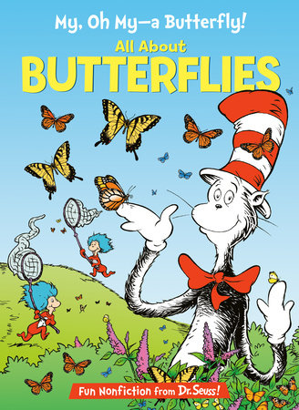

- **Title:** *My, Oh My—A Butterfly! All About Butterflies*
- **Series:** The Cat in the Hat’s Learning Library
- **Author:** Tish Rabe (characters created by Dr. Seuss)
- **Illustrated by:** Aristides Ruiz & Joe Mathieu
- **Publisher:** HarperCollins (this copy) / Random House (US)
- **ISBN (this copy):** `978-0-00-810098-8` · US: `978-0-375-82882-9`
- **Format:** Paperback · 48 pages
- **Ages:** 4–8
- **About:** The Cat in the Hat teaches beginning readers about butterflies, caterpillars, and moths — eggs, chrysalises, nectar “straws,” and monarch journeys.
- **Read?** [x] — Tuesday, August 25, 2026 · Mitch

---

### 6. Hooked on Phonics Pre-reader — Steps 7, 8 & 9 / *Whacky Jack!*

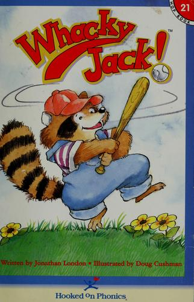

- **One book:** pink *Hooked on Phonics Pre-reader Steps 7, 8 & 9* cover and *Whacky Jack!* story cover are the two sides of the same book.
- **Story:** *Whacky Jack!* by Jonathan London, illustrated by Doug Cushman — Jack the raccoon learns baseball.
- **Publisher:** Hooked & Company (H&Co.) / Hooked on Phonics
- **Code on copy:** `16024 (08/24)` · hookedandcompany.com
- **Story ISBN (older printing):** `978-1-887942-42-3`
- **Ages:** early reader
- **About:** Letter practice for e, w, j, p, y, x, q, and z, plus the baseball story.
- **Read?** [x] — Thursday, August 27, 2026 · bedtime · Mitch

---

### 7. On Beyond Bugs!

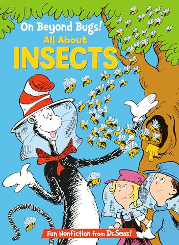

- **Title:** *On Beyond Bugs! All About Insects*
- **Series:** The Cat in the Hat’s Learning Library
- **Author:** Tish Rabe
- **Illustrated by:** Aristides Ruiz
- **Publisher:** Random House (1999) · 48 pages
- **ISBN:** `978-0-679-87303-7`
- **Ages:** 4–8
- **About:** The Cat in the Hat tours insects — bees that dance, buzzing flies, ants, moths, and more — in Seuss-style rhyme. Nice pair with *My, Oh My—A Butterfly!*
- **Read?** [x] — Thursday, August 27, 2026 · bedtime · Mitch

---

### 8. Don’t Close Your Eyes

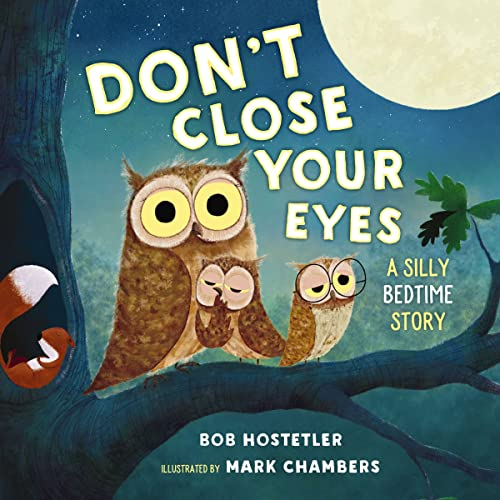

- **Title:** *Don’t Close Your Eyes: A Silly Bedtime Story*
- **Author:** Bob Hostetler
- **Illustrated by:** Mark Chambers
- **Publisher:** Tommy Nelson / Thomas Nelson (2019)
- **ISBN:** `978-1-4002-0951-4`
- **Format:** Board book · about 20 pages · cover price $9.99
- **Ages:** toddler–early reader
- **About:** A bedtime dare: whatever you do, don’t close your eyes. Sleepy animals settle in while the rhyme tries to keep little lids open… until they can’t.
- **Read?** [x] — Thursday, August 27, 2026 · bedtime · Mitch

---

### 9. There Was an Old Lady Who Swallowed a Fly

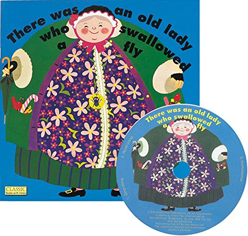

- **Illustrated by:** Pam Adams
- **Publisher:** Child’s Play — Classic Books with Holes (this copy includes CD)
- **ISBN:** `978-1-904550-62-4`
- **Format:** Paperback with die-cut holes · about 16 pages
- **Ages:** 2–6
- **About:** The classic cumulative rhyme. Holes in the pages show each new animal she swallows.
- **Read?** [x] — Thursday, August 27, 2026 · bedtime · Mitch

---

### 10. Chickens

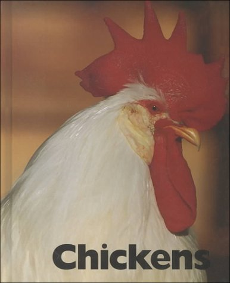

- **Author:** Mary Ann McDonald
- **Publisher:** The Child’s World (farm-animal photo series)
- **ISBN:** `978-1-56766-374-7` · ISBN-10 `1-56766-374-5`
- **Series mates:** Cows, Ducks, Horses, Pigs, Sheep
- **Call number:** `636.5 MCD` · barcode `2934015`
- **Source:** **On loan from Mt. View Elementary School library (MVES)** — not a home copy
- **About:** Photo nonfiction about chickens.
- **Favorite:** Saturday, August 29, 2026.
- **Read?** [x] — Saturday, August 29, 2026 · Mitch

---

### 11. Swap!

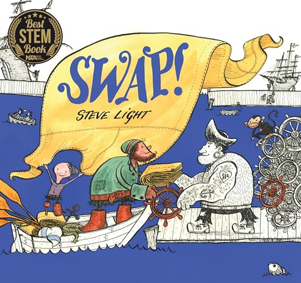

- **Author / illustrator:** Steve Light
- **Publisher:** Walker Books (UK) / Candlewick (US ISBN `978-0-7636-7990-3`)
- **ISBN (this copy):** `978-1-4063-6776-8`
- **Format:** Hardcover · about 40 pages
- **Ages:** picture book
- **About:** A broken-down ship, a loose button, and an idea: let’s SWAP! A little pirate barters one thing for another until the captain has a ship again. Same creator as *Have You Seen My Dragon?* and *Have You Seen My Monster?*
- **Favorite:** Saturday, August 29, 2026.
- **Read?** [x] — Saturday, August 29, 2026 · Mitch

---

### 12. It’s the Great Pumpkin, Charlie Brown

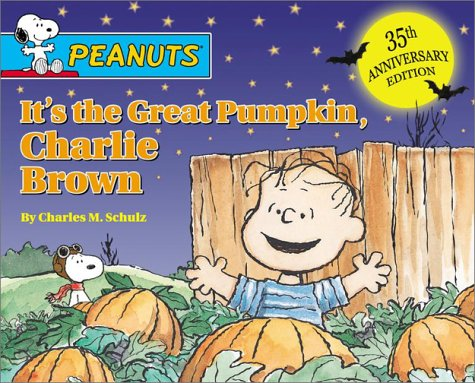

- **Series:** Peanuts
- **By:** Charles M. Schulz
- **Publisher:** Simon & Schuster / Little Simon
- **ISBN (this copy):** `978-1-4814-5388-7`
- **Format:** Picture book · 50 Years of The Great Pumpkin edition · $7.99
- **About:** Halloween with the Peanuts gang. Linus waits in the pumpkin patch for the Great Pumpkin.
- **Read?** [x] — Saturday, August 29, 2026 · Mitch

---

### 13. The Hat

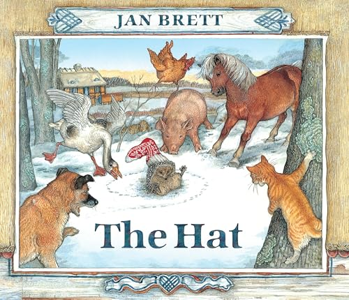

- **Author / illustrator:** Jan Brett
- **Publisher:** G.P. Putnam’s Sons / Penguin
- **ISBN:** `978-0-399-54738-6`
- **Format:** Oversized lap board book · $15.99
- **Ages:** 1–5+
- **About:** Hedgie the hedgehog gets Lisa’s wool stocking stuck on his prickles and pretends it’s a hat. Farm animals laugh — then want hats of their own. Companion to *The Mitten*.
- **Read?** [x] — Saturday, August 29, 2026 · Mitch

---

### 14. Oh, the Things They Invented!

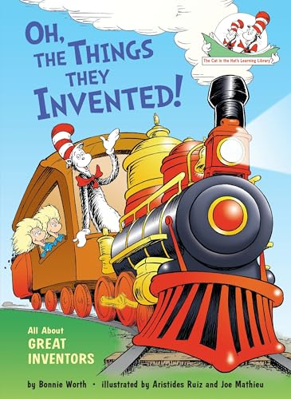

- **Title:** *Oh, the Things They Invented! All About Great Inventors*
- **Series:** The Cat in the Hat’s Learning Library
- **Author:** Bonnie Worth
- **Illustrated by:** Aristides Ruiz and Joe Mathieu
- **Publisher:** Random House (2015)
- **ISBN:** `978-0-449-81497-0`
- **Format:** Hardcover · 48 pages · $9.99
- **Ages:** 5–8
- **About:** The Cat meets inventors from the printing press and steam engine to the telephone, airplanes, windshield wipers, computers, and the World Wide Web.
- **Read?** [x] — Saturday, August 29, 2026 · Mitch

---

### 15. The Remember Balloons

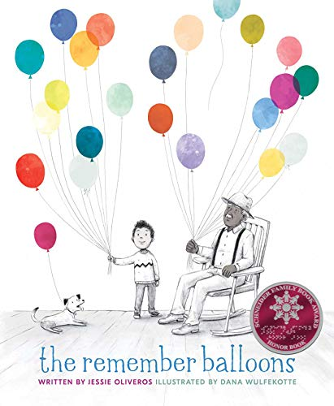

- **Author:** Jessie Oliveros
- **Illustrated by:** Dana Wulfekotte
- **Publisher:** Simon & Schuster Books for Young Readers (2018)
- **ISBN:** `978-1-4814-8915-7`
- **Format:** Hardcover · 48 pages · cover price $18.99 / $25.99 CAN
- **Ages:** 5–9
- **Awards:** 2019 Schneider Family Book Award Honor
- **About:** James’s grandpa keeps memories in brightly colored balloons. When Grandpa starts losing his balloons — a gentle picture of memory loss — James learns that shared stories become balloons of his own.
- **On our bookshelf:** home copy
- **Read?** [x] — Sunday, August 30, 2026 · Mitch

---

### 16. Frog Song

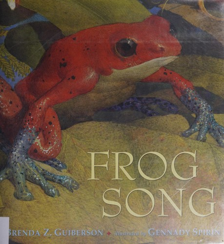

- **Author:** Brenda Z. Guiberson
- **Illustrated by:** Gennady Spirin
- **Publisher:** Henry Holt and Co. (2013)
- **ISBN:** `978-0-8050-9254-7`
- **Format:** Hardcover · 40 pages · cover price $17.99
- **Ages:** 4–8
- **About:** Frog songs from Chile to Nepal to Australia — birrups, bellows, and how different frogs care for their eggs. A frog song is a celebration of clean water, plants, and insects to eat.
- **On our bookshelf:** home copy
- **Read?** [x] — Sunday, August 30, 2026 · Mitch

---

### 17. The Party

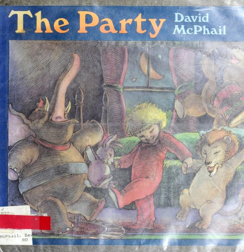

- **Author / illustrator:** David McPhail
- **Publisher:** originally Little, Brown (1990); this copy is the Hooked on Phonics / Gateway Learning paperback (Book 30)
- **ISBN (this copy, typical HOP printing):** `978-1-887942-51-5` · original hardcover `978-0-316-56330-7`
- **Format:** Paperback · 32 pages
- **Ages:** 4–8 / early reader
- **About:** Dad falls asleep mid-bedtime story. The boy and his stuffed animals come to life for a secret party — dancing, balloons, kitchen raid — and try to include sleepy Dad.
- **On our bookshelf:** home copy
- **Read?** [x] — Sunday, August 30, 2026 · Mitch

---

## How to add a new book

Copy a card above. Drop the cover JPEG in `covers/` (short-name.jpg) and use:

```

```

Or send Ellie a photo and ask her to add it.

---

## Daily reading log

Add a new day at the **top** of this list so the newest reading is first.

### Template (copy this)

```
### YYYY-MM-DD — weekday

- **Book:**
- **Who read:** (Dad / Mom / together / solo)
- **Stars:** ★★★★☆
- **Favorite part:**
- **New word or question:**
- **Read it again?** yes / not yet
```

---

### 2026-08-30 — Sunday

Three books from the home shelf, read by Mitch.

- **Book:** *The Remember Balloons* (Jessie Oliveros / Dana Wulfekotte)
- **Who read:** Mitch
- **Notes:** Home copy. ISBN 978-1-4814-8915-7.

- **Book:** *Frog Song* (Brenda Z. Guiberson / Gennady Spirin)
- **Who read:** Mitch
- **Notes:** Home copy. ISBN 978-0-8050-9254-7.

- **Book:** *The Party* (David McPhail)
- **Who read:** Mitch
- **Notes:** Home copy. Hooked on Phonics paperback of the 1990 picture book.

---

### 2026-08-29 — Saturday

Five books, read by Mitch. *Chickens* is a Mt. View Elementary School library loan.

**Favorites:** *Chickens* and *Swap!*

- **Book:** *Chickens* (Mary Ann McDonald)
- **Who read:** Mitch
- **Notes:** MVES library book on loan. Call number 636.5 MCD. Favorite.

- **Book:** *Swap!* (Steve Light)
- **Who read:** Mitch
- **Notes:** Favorite.

- **Book:** *It’s the Great Pumpkin, Charlie Brown*
- **Who read:** Mitch

- **Book:** *The Hat* (Jan Brett)
- **Who read:** Mitch

- **Book:** *Oh, the Things They Invented!*
- **Who read:** Mitch
- **Notes:** Third Cat in the Hat Learning Library title this week.

---

### 2026-08-28 — Friday

- **Book:** none
- **Who read:** Amy
- **Notes:** Amy did not read any books Friday.

---

### 2026-08-27 — Thursday

Bedtime stack. Four books, all read by Mitch.

- **Book:** *Hooked on Phonics Pre-reader Steps 7, 8 & 9* / *Whacky Jack!*
- **Who read:** Mitch
- **Notes:** Same book — pink phonics cover and *Whacky Jack!* story cover. Jack the raccoon plays baseball; letters e, w, j, p, y, x, q, z.

- **Book:** *On Beyond Bugs! All About Insects*
- **Who read:** Mitch
- **Notes:** Cat in the Hat Learning Library — pairs with Tuesday’s butterfly book.

- **Book:** *Don’t Close Your Eyes*
- **Who read:** Mitch
- **Notes:** Silly bedtime dare with sleepy animals.

- **Book:** *There Was an Old Lady Who Swallowed a Fly*
- **Who read:** Mitch
- **Notes:** Child’s Play die-cut edition with CD.

---

### 2026-08-26 — Wednesday

First day of second grade.

- **Book:** none
- **Who read:** Amy
- **Notes:** Amy did not read any of these books yesterday.

---

### 2026-08-25 — Tuesday

Four books, all read by Mitch. Night-before energy for the first day of second grade.

- **Book:** *The Night Before Kindergarten*
- **Who read:** Mitch
- **Favorite part:** Read it as *The Night Before 2nd Grade* — swapped “kindergarten” for “2nd grade” because Wednesday was the first day of second grade.
- **Read it again?**

- **Book:** *Cowboy Car*
- **Who read:** Mitch
- **Stars:**
- **Favorite part:**
- **Read it again?**

- **Book:** *Except Antarctica!*
- **Who read:** Mitch
- **Stars:**
- **Favorite part:**
- **Read it again?**

- **Book:** *My, Oh My—A Butterfly!*
- **Who read:** Mitch
- **Stars:**
- **Favorite part:**
- **Read it again?**

---

### 2026-08-24 — Monday

- **Book:** *Garfield’s Scary Tales*
- **Who read:** Mitch
- **Favorite part:** *Terminal Terror* (the computer that comes alive) and the camping story (*A Ghost’s Story*, with the lumberjack around the campfire).
- **Read it again?**
